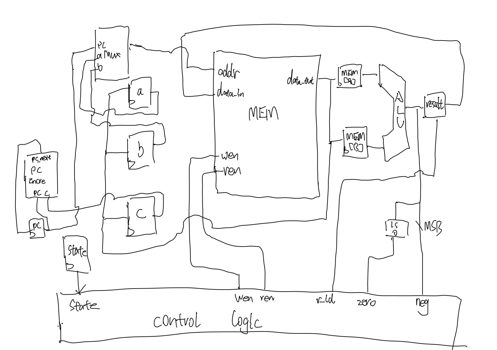

# Taste of SUBLEQ architecture design and Programing 
A loop-based implementation of Fibonacci sequence runs on SUBLEQ processor.
## subleq overall design hand drawing graph

## Microarchitecture Design
### Synchronous read/write and single port memory
9 states for  Synchronous read/write and single port memory:
Fetch A     
Fetch B, Load A     
Fetch C, Load B    
Fetch Mem[A], Load C      
Fetch Mem[B], Load Mem[A]& Load Mem[B]    
Execute   
Writeback     
Update_PC   
### Synchronous read/write and dual ports memory
7 states for  Synchronous read/write and Dual ports memory:
Fetch AB & Load AB    
Fetch Mem[A],Mem[B] & Load Mem[A],Mem[B]   
Execute,Fetch C&Load C    
Writeback, Update_PC    

## To run test
```
cd ./test
python3 -m venv
source ./venv/bin/activate
cd  subleq_test directory 
make 
```

## Fib(8) Program Overview

This program calculates the 8th Fibonacci number (21) using a single instruction set computer (SUBLEQ) architecture. The implementation uses a compact loop structure instead of unrolled iterations.

## Memory Layout

**Data Section (Addresses 0-9):**
- `0`: A (previous Fibonacci number)
- `1`: NEG_A (negative of A)  
- `2`: B (current Fibonacci number)
- `3`: NEG_B (negative of B)
- `4`: TMP (temporary variable)
- `5`: NEG_TMP (negative of TMP)
- `6`: ZERO (constant 0)
- `7`: COUNTER (loop counter = 7)
- `8`: ONE (constant 1)
- `9`: NEG_ONE (constant -1)

**Program Section (Addresses 10-60):**
- Loop implementation with conditional branching
- Arithmetic operations using SUBLEQ instruction
- Halt condition at address 58

## Algorithm

### Initialization
- A = 0 (first Fibonacci number)
- B = 1 (second Fibonacci number)
- COUNTER = 7 (iterate 7 times to reach F(8))

### Main Loop (Addresses 10-57)

**Step 1: Loop Control (Addresses 10-12)**
```
SUBLEQ ONE, COUNTER, HALT
```
- **High-level idea**: Check if we should continue looping
- **Implementation**: Subtract 1 from COUNTER, if COUNTER ≤ 0, jump to HALT
- **SUBLEQ semantics**: `COUNTER = COUNTER - ONE; if (COUNTER ≤ 0) goto HALT`

**Step 2: Calculate TMP = A + B (Addresses 13-27)**
```
SUBLEQ TMP, TMP, _        # Clear TMP
SUBLEQ NEG_B, TMP, _      # TMP = TMP + B (by subtracting -B)
SUBLEQ NEG_A, TMP, _      # TMP = TMP + A (by subtracting -A)
```
- **High-level idea**: Compute next Fibonacci number (sum of previous two)
- **Implementation**: Since SUBLEQ only subtracts, addition is achieved by subtracting negative values
- **Result**: TMP now contains A + B

**Step 3: Update A = B (Addresses 28-36)**
```
SUBLEQ A, A, _           # Clear A
SUBLEQ NEG_B, A, _       # A = A + B (by subtracting -B)
SUBLEQ NEG_A, NEG_A, _   # Clear NEG_A
SUBLEQ A, NEG_A, _       # NEG_A = NEG_A - A (making NEG_A = -A)
```
- **High-level idea**: Shift the Fibonacci sequence window forward
- **Implementation**: Copy current value B into previous value A
- **Maintains invariant**: A always holds the previous Fibonacci number

**Step 4: Update B = TMP (Addresses 37-51)**
```
SUBLEQ B, B, _           # Clear B
SUBLEQ NEG_TMP, B, _     # B = B + TMP (by subtracting -TMP)
SUBLEQ NEG_B, NEG_B, _   # Clear NEG_B
SUBLEQ B, NEG_B, _       # NEG_B = NEG_B - B (making NEG_B = -B)
```
- **High-level idea**: Update current Fibonacci number to the newly calculated value
- **Implementation**: Copy computed sum (TMP) into current value B
- **Maintains invariant**: B always holds the current Fibonacci number

**Step 5: Loop Back (Addresses 55-57)**
```
SUBLEQ ZERO, ZERO, LOOP_START
```
- **High-level idea**: Unconditional jump back to loop beginning
- **Implementation**: Since ZERO - ZERO = 0 ≤ 0, always branches
- **Effect**: Creates the loop structure

### Termination (Address 58)
- **Condition**: When COUNTER becomes ≤ 0
- **Result**: Program halts with F(8) = 21 stored in memory location 2 (B)
- **Verification**: Sequence progression: F(0)=0 → F(1)=1 → F(2)=1 → F(3)=2 → F(4)=3 → F(5)=5 → F(6)=8 → F(7)=13 → F(8)=21

## Key SUBLEQ Programming Techniques

1. **Addition via Double Negative**: `A + B` implemented as `A - (-B)`
2. **Variable Assignment**: `X = Y` implemented as `X = 0; X = X - (-Y)`
3. **Conditional Branching**: Natural part of SUBLEQ instruction
4. **Unconditional Jump**: `SUBLEQ ZERO, ZERO, target` always branches
5. **Loop Counter**: Decrement and test in single instruction

## Expected Result

- Final value at memory[2]: **21** (8th Fibonacci number)
- Program execution: Starts at PC=10, halts at PC=58
- Fibonacci sequence: 0, 1, 1, 2, 3, 5, 8, 13, **21**

## Files

- `fib_8_loop_new.hex`: Program binary in hexadecimal format
- `hw_sim/`: Hardware simulation modules
- `test/subleq/`: Test files and simulation scripts

```
